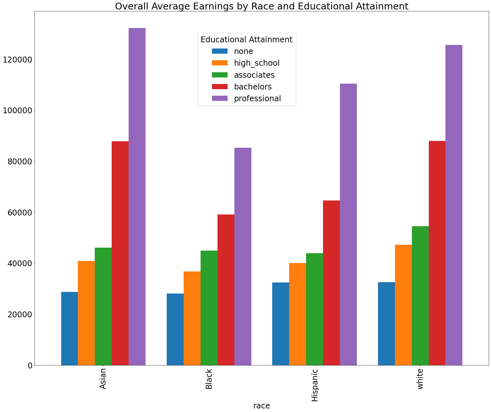

```python
import pandas as pd
import numpy as np
import matplotlib as plt
import matplotlib.dates as mdates
from matplotlib.dates import DateFormatter
```


```python
# load df, convert year to date/time and view
df = pd.read_csv("540_project_df.csv", parse_dates=['year'])
df.head()
```


<div>
<style scoped>
    .dataframe tbody tr th:only-of-type {
        vertical-align: middle;
    }

    .dataframe tbody tr th {
        vertical-align: top;
    }

    .dataframe thead th {
        text-align: right;
    }
</style>
<table border="1" class="dataframe">
  <thead>
    <tr style="text-align: right;">
      <th></th>
      <th>race</th>
      <th>sex</th>
      <th>year</th>
      <th>salary_no</th>
      <th>num_none</th>
      <th>std_none</th>
      <th>salary_hs</th>
      <th>num_hs</th>
      <th>std_hs</th>
      <th>salary_2yr</th>
      <th>num_2yr</th>
      <th>std_2yr</th>
      <th>salary_4yr</th>
      <th>num_4yr</th>
      <th>std_4yr</th>
      <th>salary_6yr</th>
      <th>num_6yr</th>
      <th>std_6yr</th>
    </tr>
  </thead>
  <tbody>
    <tr>
      <th>0</th>
      <td>white</td>
      <td>Male</td>
      <td>2018-01-01</td>
      <td>32458.0</td>
      <td>6098.00</td>
      <td>838.00</td>
      <td>47199.0</td>
      <td>19815.00</td>
      <td>625.00</td>
      <td>54482.0</td>
      <td>18546.00</td>
      <td>847.00</td>
      <td>87842.0</td>
      <td>16080.00</td>
      <td>1263.00</td>
      <td>125533.0</td>
      <td>8516.00</td>
      <td>2358.00</td>
    </tr>
    <tr>
      <th>1</th>
      <td>white</td>
      <td>Male</td>
      <td>2017-01-01</td>
      <td>32096.0</td>
      <td>6277.00</td>
      <td>649.00</td>
      <td>46284.0</td>
      <td>19933.00</td>
      <td>528.00</td>
      <td>51974.0</td>
      <td>18724.00</td>
      <td>538.00</td>
      <td>83478.0</td>
      <td>15913.00</td>
      <td>837.00</td>
      <td>122160.0</td>
      <td>8373.00</td>
      <td>1892.00</td>
    </tr>
    <tr>
      <th>2</th>
      <td>white</td>
      <td>Male</td>
      <td>2016-01-01</td>
      <td>33153.0</td>
      <td>6255.00</td>
      <td>883.00</td>
      <td>45390.0</td>
      <td>19941.00</td>
      <td>546.00</td>
      <td>50063.0</td>
      <td>18951.00</td>
      <td>510.00</td>
      <td>84069.0</td>
      <td>15136.00</td>
      <td>961.00</td>
      <td>116854.0</td>
      <td>8211.00</td>
      <td>1734.00</td>
    </tr>
    <tr>
      <th>3</th>
      <td>white</td>
      <td>Male</td>
      <td>2015-01-01</td>
      <td>31336.0</td>
      <td>6755.00</td>
      <td>748.00</td>
      <td>43711.0</td>
      <td>19807.00</td>
      <td>472.00</td>
      <td>47900.0</td>
      <td>18905.00</td>
      <td>454.00</td>
      <td>82495.0</td>
      <td>14884.00</td>
      <td>1005.00</td>
      <td>115094.0</td>
      <td>8257.00</td>
      <td>1708.00</td>
    </tr>
    <tr>
      <th>4</th>
      <td>white</td>
      <td>Male</td>
      <td>2014-01-01</td>
      <td>30342.0</td>
      <td>6858.00</td>
      <td>780.00</td>
      <td>41492.0</td>
      <td>19815.00</td>
      <td>381.00</td>
      <td>48405.0</td>
      <td>18518.00</td>
      <td>562.00</td>
      <td>78348.0</td>
      <td>14409.00</td>
      <td>886.00</td>
      <td>112351.0</td>
      <td>7864.00</td>
      <td>1706.00</td>
    </tr>
  </tbody>
</table>
</div>


```python
# Only show year from datetime
df['year'] = pd.DatetimeIndex(df['year']).year
```


```python
# subset features
shortdf = df[['race', 'sex', 'year', 'salary_no', 'salary_hs', 'salary_2yr',
                 'salary_4yr', 'salary_6yr']]
shortdf
```


<div>
<style scoped>
    .dataframe tbody tr th:only-of-type {
        vertical-align: middle;
    }

    .dataframe tbody tr th {
        vertical-align: top;
    }

    .dataframe thead th {
        text-align: right;
    }
</style>
<table border="1" class="dataframe">
  <thead>
    <tr style="text-align: right;">
      <th></th>
      <th>race</th>
      <th>sex</th>
      <th>year</th>
      <th>salary_no</th>
      <th>salary_hs</th>
      <th>salary_2yr</th>
      <th>salary_4yr</th>
      <th>salary_6yr</th>
    </tr>
  </thead>
  <tbody>
    <tr>
      <th>0</th>
      <td>white</td>
      <td>Male</td>
      <td>2018</td>
      <td>32458.0</td>
      <td>47199.0</td>
      <td>54482.0</td>
      <td>87842.0</td>
      <td>125533.0</td>
    </tr>
    <tr>
      <th>1</th>
      <td>white</td>
      <td>Male</td>
      <td>2017</td>
      <td>32096.0</td>
      <td>46284.0</td>
      <td>51974.0</td>
      <td>83478.0</td>
      <td>122160.0</td>
    </tr>
    <tr>
      <th>2</th>
      <td>white</td>
      <td>Male</td>
      <td>2016</td>
      <td>33153.0</td>
      <td>45390.0</td>
      <td>50063.0</td>
      <td>84069.0</td>
      <td>116854.0</td>
    </tr>
    <tr>
      <th>3</th>
      <td>white</td>
      <td>Male</td>
      <td>2015</td>
      <td>31336.0</td>
      <td>43711.0</td>
      <td>47900.0</td>
      <td>82495.0</td>
      <td>115094.0</td>
    </tr>
    <tr>
      <th>4</th>
      <td>white</td>
      <td>Male</td>
      <td>2014</td>
      <td>30342.0</td>
      <td>41492.0</td>
      <td>48405.0</td>
      <td>78348.0</td>
      <td>112351.0</td>
    </tr>
    <tr>
      <th>...</th>
      <td>...</td>
      <td>...</td>
      <td>...</td>
      <td>...</td>
      <td>...</td>
      <td>...</td>
      <td>...</td>
      <td>...</td>
    </tr>
    <tr>
      <th>289</th>
      <td>Hispanic</td>
      <td>Female</td>
      <td>1979</td>
      <td>4675.0</td>
      <td>6708.0</td>
      <td>7069.0</td>
      <td>9168.0</td>
      <td>13313.0</td>
    </tr>
    <tr>
      <th>290</th>
      <td>Hispanic</td>
      <td>Female</td>
      <td>1978</td>
      <td>4135.0</td>
      <td>5834.0</td>
      <td>6686.0</td>
      <td>9684.0</td>
      <td>10908.0</td>
    </tr>
    <tr>
      <th>291</th>
      <td>Hispanic</td>
      <td>Female</td>
      <td>1977</td>
      <td>3707.0</td>
      <td>5466.0</td>
      <td>5588.0</td>
      <td>9082.0</td>
      <td>10569.0</td>
    </tr>
    <tr>
      <th>292</th>
      <td>Hispanic</td>
      <td>Female</td>
      <td>1976</td>
      <td>3537.0</td>
      <td>5124.0</td>
      <td>5075.0</td>
      <td>6884.0</td>
      <td>9218.0</td>
    </tr>
    <tr>
      <th>293</th>
      <td>Hispanic</td>
      <td>Female</td>
      <td>1975</td>
      <td>3233.0</td>
      <td>4708.0</td>
      <td>4790.0</td>
      <td>6226.0</td>
      <td>8067.0</td>
    </tr>
  </tbody>
</table>
<p>294 rows × 8 columns</p>
</div>


```python
# rename features
shortdf = shortdf.rename(columns={"salary_no": "none", "salary_hs": "high_school",
                        "salary_2yr": "associates", "salary_4yr": "bachelors",
                        "salary_6yr": "professional"})

```


```python
# check for duplicates
duplicate = shortdf[shortdf.duplicated(keep = 'last')]
print('There are',len(duplicate),'duplicated rows')
```

    There are 0 duplicated rows


```python
# check for null values
shortdf.isnull().values.any()
```


    False


```python
# group subset data by annual mean incomes
yr_degree = shortdf.groupby('year').mean()
yr_degree.head()
```


<div>
<style scoped>
    .dataframe tbody tr th:only-of-type {
        vertical-align: middle;
    }

    .dataframe tbody tr th {
        vertical-align: top;
    }

    .dataframe thead th {
        text-align: right;
    }
</style>
<table border="1" class="dataframe">
  <thead>
    <tr style="text-align: right;">
      <th></th>
      <th>none</th>
      <th>high_school</th>
      <th>associates</th>
      <th>bachelors</th>
      <th>professional</th>
    </tr>
    <tr>
      <th>year</th>
      <th></th>
      <th></th>
      <th></th>
      <th></th>
      <th></th>
    </tr>
  </thead>
  <tbody>
    <tr>
      <th>1975</th>
      <td>5590.400000</td>
      <td>7325.400000</td>
      <td>7611.200000</td>
      <td>10665.200000</td>
      <td>13872.8</td>
    </tr>
    <tr>
      <th>1976</th>
      <td>6060.400000</td>
      <td>7906.200000</td>
      <td>7894.400000</td>
      <td>11407.400000</td>
      <td>14976.4</td>
    </tr>
    <tr>
      <th>1977</th>
      <td>6402.000000</td>
      <td>8633.000000</td>
      <td>8793.200000</td>
      <td>12704.000000</td>
      <td>15945.4</td>
    </tr>
    <tr>
      <th>1978</th>
      <td>7045.600000</td>
      <td>9270.600000</td>
      <td>9871.800000</td>
      <td>14181.400000</td>
      <td>17146.4</td>
    </tr>
    <tr>
      <th>1979</th>
      <td>7081.666667</td>
      <td>9432.833333</td>
      <td>10240.333333</td>
      <td>14477.833333</td>
      <td>18422.5</td>
    </tr>
  </tbody>
</table>
</div>


```python
# index by year
shortdf.set_index('year')
shortdf.dtypes
```


    race             object
    sex              object
    year              int64
    none            float64
    high_school     float64
    associates      float64
    bachelors       float64
    professional    float64
    dtype: object


```python
# connect to db and create sql table from existing df
import sqlite3
conn = sqlite3.connect("DSC540.db")
shortdf.to_sql("income", conn, if_exists="replace", index=False)
```


```python
from urllib.request import urlopen
from bs4 import BeautifulSoup
```


```python
# convert website html to dataframe
infl_df = pd.read_html('https://www.usinflationcalculator.com/inflation/consumer-price-index-and-annual-percent-changes-from-1913-to-2008/')[0]
infl_df.head()
```


<div>
<style scoped>
    .dataframe tbody tr th:only-of-type {
        vertical-align: middle;
    }

    .dataframe tbody tr th {
        vertical-align: top;
    }

    .dataframe thead th {
        text-align: right;
    }
</style>
<table border="1" class="dataframe">
  <thead>
    <tr style="text-align: right;">
      <th></th>
      <th>0</th>
      <th>1</th>
      <th>2</th>
      <th>3</th>
      <th>4</th>
      <th>5</th>
      <th>6</th>
      <th>7</th>
      <th>8</th>
      <th>9</th>
      <th>10</th>
      <th>11</th>
      <th>12</th>
      <th>13</th>
      <th>14</th>
      <th>15</th>
    </tr>
  </thead>
  <tbody>
    <tr>
      <th>0</th>
      <td>NaN</td>
      <td>NaN</td>
      <td>NaN</td>
      <td>NaN</td>
      <td>NaN</td>
      <td>NaN</td>
      <td>NaN</td>
      <td>NaN</td>
      <td>NaN</td>
      <td>NaN</td>
      <td>NaN</td>
      <td>NaN</td>
      <td>NaN</td>
      <td>Annual</td>
      <td>Percent Change</td>
      <td>Percent Change</td>
    </tr>
    <tr>
      <th>1</th>
      <td>Year</td>
      <td>Jan</td>
      <td>Feb</td>
      <td>Mar</td>
      <td>Apr</td>
      <td>May</td>
      <td>June</td>
      <td>July</td>
      <td>Aug</td>
      <td>Sep</td>
      <td>Oct</td>
      <td>Nov</td>
      <td>Dec</td>
      <td>Avg</td>
      <td>Dec-Dec</td>
      <td>Avg-Avg</td>
    </tr>
    <tr>
      <th>2</th>
      <td>1913</td>
      <td>9.8</td>
      <td>9.8</td>
      <td>9.8</td>
      <td>9.8</td>
      <td>9.7</td>
      <td>9.8</td>
      <td>9.9</td>
      <td>9.9</td>
      <td>10.0</td>
      <td>10.0</td>
      <td>10.1</td>
      <td>10.0</td>
      <td>9.9</td>
      <td>–</td>
      <td>–</td>
    </tr>
    <tr>
      <th>3</th>
      <td>1914</td>
      <td>10.0</td>
      <td>9.9</td>
      <td>9.9</td>
      <td>9.8</td>
      <td>9.9</td>
      <td>9.9</td>
      <td>10.0</td>
      <td>10.2</td>
      <td>10.2</td>
      <td>10.1</td>
      <td>10.2</td>
      <td>10.1</td>
      <td>10.0</td>
      <td>1.0</td>
      <td>1.0</td>
    </tr>
    <tr>
      <th>4</th>
      <td>1915</td>
      <td>10.1</td>
      <td>10.0</td>
      <td>9.9</td>
      <td>10.0</td>
      <td>10.1</td>
      <td>10.1</td>
      <td>10.1</td>
      <td>10.1</td>
      <td>10.1</td>
      <td>10.2</td>
      <td>10.3</td>
      <td>10.3</td>
      <td>10.1</td>
      <td>2.0</td>
      <td>1.0</td>
    </tr>
  </tbody>
</table>
</div>


```python
# drop first index
infl_df = infl_df.drop([infl_df.index[0]]) 
infl_df.head()
```


<div>
<style scoped>
    .dataframe tbody tr th:only-of-type {
        vertical-align: middle;
    }

    .dataframe tbody tr th {
        vertical-align: top;
    }

    .dataframe thead th {
        text-align: right;
    }
</style>
<table border="1" class="dataframe">
  <thead>
    <tr style="text-align: right;">
      <th></th>
      <th>0</th>
      <th>1</th>
      <th>2</th>
      <th>3</th>
      <th>4</th>
      <th>5</th>
      <th>6</th>
      <th>7</th>
      <th>8</th>
      <th>9</th>
      <th>10</th>
      <th>11</th>
      <th>12</th>
      <th>13</th>
      <th>14</th>
      <th>15</th>
    </tr>
  </thead>
  <tbody>
    <tr>
      <th>1</th>
      <td>Year</td>
      <td>Jan</td>
      <td>Feb</td>
      <td>Mar</td>
      <td>Apr</td>
      <td>May</td>
      <td>June</td>
      <td>July</td>
      <td>Aug</td>
      <td>Sep</td>
      <td>Oct</td>
      <td>Nov</td>
      <td>Dec</td>
      <td>Avg</td>
      <td>Dec-Dec</td>
      <td>Avg-Avg</td>
    </tr>
    <tr>
      <th>2</th>
      <td>1913</td>
      <td>9.8</td>
      <td>9.8</td>
      <td>9.8</td>
      <td>9.8</td>
      <td>9.7</td>
      <td>9.8</td>
      <td>9.9</td>
      <td>9.9</td>
      <td>10.0</td>
      <td>10.0</td>
      <td>10.1</td>
      <td>10.0</td>
      <td>9.9</td>
      <td>–</td>
      <td>–</td>
    </tr>
    <tr>
      <th>3</th>
      <td>1914</td>
      <td>10.0</td>
      <td>9.9</td>
      <td>9.9</td>
      <td>9.8</td>
      <td>9.9</td>
      <td>9.9</td>
      <td>10.0</td>
      <td>10.2</td>
      <td>10.2</td>
      <td>10.1</td>
      <td>10.2</td>
      <td>10.1</td>
      <td>10.0</td>
      <td>1.0</td>
      <td>1.0</td>
    </tr>
    <tr>
      <th>4</th>
      <td>1915</td>
      <td>10.1</td>
      <td>10.0</td>
      <td>9.9</td>
      <td>10.0</td>
      <td>10.1</td>
      <td>10.1</td>
      <td>10.1</td>
      <td>10.1</td>
      <td>10.1</td>
      <td>10.2</td>
      <td>10.3</td>
      <td>10.3</td>
      <td>10.1</td>
      <td>2.0</td>
      <td>1.0</td>
    </tr>
    <tr>
      <th>5</th>
      <td>1916</td>
      <td>10.4</td>
      <td>10.4</td>
      <td>10.5</td>
      <td>10.6</td>
      <td>10.7</td>
      <td>10.8</td>
      <td>10.8</td>
      <td>10.9</td>
      <td>11.1</td>
      <td>11.3</td>
      <td>11.5</td>
      <td>11.6</td>
      <td>10.9</td>
      <td>12.6</td>
      <td>7.9</td>
    </tr>
  </tbody>
</table>
</div>


```python
# copy row index 0 to column headers
infl_df.columns = infl_df.iloc[0]
# delete row index 0
infl_df = infl_df.drop(infl_df.index[0])
infl_df.head()
```


<div>
<style scoped>
    .dataframe tbody tr th:only-of-type {
        vertical-align: middle;
    }

    .dataframe tbody tr th {
        vertical-align: top;
    }

    .dataframe thead th {
        text-align: right;
    }
</style>
<table border="1" class="dataframe">
  <thead>
    <tr style="text-align: right;">
      <th>1</th>
      <th>Year</th>
      <th>Jan</th>
      <th>Feb</th>
      <th>Mar</th>
      <th>Apr</th>
      <th>May</th>
      <th>June</th>
      <th>July</th>
      <th>Aug</th>
      <th>Sep</th>
      <th>Oct</th>
      <th>Nov</th>
      <th>Dec</th>
      <th>Avg</th>
      <th>Dec-Dec</th>
      <th>Avg-Avg</th>
    </tr>
  </thead>
  <tbody>
    <tr>
      <th>2</th>
      <td>1913</td>
      <td>9.8</td>
      <td>9.8</td>
      <td>9.8</td>
      <td>9.8</td>
      <td>9.7</td>
      <td>9.8</td>
      <td>9.9</td>
      <td>9.9</td>
      <td>10.0</td>
      <td>10.0</td>
      <td>10.1</td>
      <td>10.0</td>
      <td>9.9</td>
      <td>–</td>
      <td>–</td>
    </tr>
    <tr>
      <th>3</th>
      <td>1914</td>
      <td>10.0</td>
      <td>9.9</td>
      <td>9.9</td>
      <td>9.8</td>
      <td>9.9</td>
      <td>9.9</td>
      <td>10.0</td>
      <td>10.2</td>
      <td>10.2</td>
      <td>10.1</td>
      <td>10.2</td>
      <td>10.1</td>
      <td>10.0</td>
      <td>1.0</td>
      <td>1.0</td>
    </tr>
    <tr>
      <th>4</th>
      <td>1915</td>
      <td>10.1</td>
      <td>10.0</td>
      <td>9.9</td>
      <td>10.0</td>
      <td>10.1</td>
      <td>10.1</td>
      <td>10.1</td>
      <td>10.1</td>
      <td>10.1</td>
      <td>10.2</td>
      <td>10.3</td>
      <td>10.3</td>
      <td>10.1</td>
      <td>2.0</td>
      <td>1.0</td>
    </tr>
    <tr>
      <th>5</th>
      <td>1916</td>
      <td>10.4</td>
      <td>10.4</td>
      <td>10.5</td>
      <td>10.6</td>
      <td>10.7</td>
      <td>10.8</td>
      <td>10.8</td>
      <td>10.9</td>
      <td>11.1</td>
      <td>11.3</td>
      <td>11.5</td>
      <td>11.6</td>
      <td>10.9</td>
      <td>12.6</td>
      <td>7.9</td>
    </tr>
    <tr>
      <th>6</th>
      <td>1917</td>
      <td>11.7</td>
      <td>12.0</td>
      <td>12.0</td>
      <td>12.6</td>
      <td>12.8</td>
      <td>13.0</td>
      <td>12.8</td>
      <td>13.0</td>
      <td>13.3</td>
      <td>13.5</td>
      <td>13.5</td>
      <td>13.7</td>
      <td>12.8</td>
      <td>18.1</td>
      <td>17.4</td>
    </tr>
  </tbody>
</table>
</div>


```python
# convert objects to numeric
infl_df['Year'] = pd.to_numeric(infl_df['Year'])
infl_df['Avg'] = pd.to_numeric(infl_df['Avg'])
```


```python
# filter matching years only
infl_df = infl_df.loc[(infl_df['Year'] >= 1975) & (infl_df['Year'] <= 2018)]
```


```python
# only keep year and avg cost living
short_infl_df = infl_df[['Year','Avg']]
```


```python
# index by year
short_infl_df.set_index('Year')
short_infl_df = short_infl_df.rename(columns={"Year": "year"})
```


```python
short_infl_df = short_infl_df.rename(columns={"Avg": "cost_living"})
```


```python
# convert pandas dataframe to sql table
short_infl_df.to_sql("inflation", conn, if_exists="replace", index=False)
```


```python
# import information from BLS API
# Only allowed 10 years of data at a time
import bls
api1 = bls.get_series('CUUR0000SEEB01', 1978, 1987)
api2 = bls.get_series('CUUR0000SEEB01', 1988, 1997)
api3 = bls.get_series('CUUR0000SEEB01', 1998, 2007)
api4 = bls.get_series('CUUR0000SEEB01', 2008, 2017)
api5 = bls.get_series('CUUR0000SEEB01', 2018, 2018)
```


```python
# merge each decade of data
api_df = api1.append([api2, api3, api4, api5])
```


```python
# create dataframe
api_df = api_df.to_frame()
api_df = api_df.reset_index()
```


```python
api_df['date'].dtype
```


    period[M]


```python
# check column headers
for col in api_df.columns: 
    print(col) 
```

    date
    CUUR0000SEEB01


```python
# group by year
ave_api_df = api_df.set_index('date').groupby(pd.Grouper(freq='a')).mean().dropna(how='all')
```


```python
# convert period type to timestamp
# rename columns
ave_api_df = ave_api_df.to_timestamp()
ave_api_df = ave_api_df.reset_index()
ave_api_df = ave_api_df.rename(columns={'date': 'year', 'CUUR0000SEEB01': 'tuition'})
ave_api_df
```


<div>
<style scoped>
    .dataframe tbody tr th:only-of-type {
        vertical-align: middle;
    }

    .dataframe tbody tr th {
        vertical-align: top;
    }

    .dataframe thead th {
        text-align: right;
    }
</style>
<table border="1" class="dataframe">
  <thead>
    <tr style="text-align: right;">
      <th></th>
      <th>year</th>
      <th>tuition</th>
    </tr>
  </thead>
  <tbody>
    <tr>
      <th>0</th>
      <td>1978-01-01</td>
      <td>59.908333</td>
    </tr>
    <tr>
      <th>1</th>
      <td>1979-01-01</td>
      <td>64.666667</td>
    </tr>
    <tr>
      <th>2</th>
      <td>1980-01-01</td>
      <td>70.833333</td>
    </tr>
    <tr>
      <th>3</th>
      <td>1981-01-01</td>
      <td>79.625000</td>
    </tr>
    <tr>
      <th>4</th>
      <td>1982-01-01</td>
      <td>90.325000</td>
    </tr>
    <tr>
      <th>5</th>
      <td>1983-01-01</td>
      <td>99.725000</td>
    </tr>
    <tr>
      <th>6</th>
      <td>1984-01-01</td>
      <td>109.941667</td>
    </tr>
    <tr>
      <th>7</th>
      <td>1985-01-01</td>
      <td>119.925000</td>
    </tr>
    <tr>
      <th>8</th>
      <td>1986-01-01</td>
      <td>129.633333</td>
    </tr>
    <tr>
      <th>9</th>
      <td>1987-01-01</td>
      <td>139.383333</td>
    </tr>
    <tr>
      <th>10</th>
      <td>1988-01-01</td>
      <td>150.000000</td>
    </tr>
    <tr>
      <th>11</th>
      <td>1989-01-01</td>
      <td>161.900000</td>
    </tr>
    <tr>
      <th>12</th>
      <td>1990-01-01</td>
      <td>174.966667</td>
    </tr>
    <tr>
      <th>13</th>
      <td>1991-01-01</td>
      <td>192.783333</td>
    </tr>
    <tr>
      <th>14</th>
      <td>1992-01-01</td>
      <td>213.516667</td>
    </tr>
    <tr>
      <th>15</th>
      <td>1993-01-01</td>
      <td>233.491667</td>
    </tr>
    <tr>
      <th>16</th>
      <td>1994-01-01</td>
      <td>249.791667</td>
    </tr>
    <tr>
      <th>17</th>
      <td>1995-01-01</td>
      <td>264.816667</td>
    </tr>
    <tr>
      <th>18</th>
      <td>1996-01-01</td>
      <td>279.800000</td>
    </tr>
    <tr>
      <th>19</th>
      <td>1997-01-01</td>
      <td>294.100000</td>
    </tr>
    <tr>
      <th>20</th>
      <td>1998-01-01</td>
      <td>306.525000</td>
    </tr>
    <tr>
      <th>21</th>
      <td>1999-01-01</td>
      <td>318.691667</td>
    </tr>
    <tr>
      <th>22</th>
      <td>2000-01-01</td>
      <td>331.866667</td>
    </tr>
    <tr>
      <th>23</th>
      <td>2001-01-01</td>
      <td>348.833333</td>
    </tr>
    <tr>
      <th>24</th>
      <td>2002-01-01</td>
      <td>372.633333</td>
    </tr>
    <tr>
      <th>25</th>
      <td>2003-01-01</td>
      <td>403.850000</td>
    </tr>
    <tr>
      <th>26</th>
      <td>2004-01-01</td>
      <td>442.116667</td>
    </tr>
    <tr>
      <th>27</th>
      <td>2005-01-01</td>
      <td>475.125000</td>
    </tr>
    <tr>
      <th>28</th>
      <td>2006-01-01</td>
      <td>506.966667</td>
    </tr>
    <tr>
      <th>29</th>
      <td>2007-01-01</td>
      <td>538.687250</td>
    </tr>
    <tr>
      <th>30</th>
      <td>2008-01-01</td>
      <td>572.282917</td>
    </tr>
    <tr>
      <th>31</th>
      <td>2009-01-01</td>
      <td>606.673750</td>
    </tr>
    <tr>
      <th>32</th>
      <td>2010-01-01</td>
      <td>638.187917</td>
    </tr>
    <tr>
      <th>33</th>
      <td>2011-01-01</td>
      <td>670.250583</td>
    </tr>
    <tr>
      <th>34</th>
      <td>2012-01-01</td>
      <td>702.757667</td>
    </tr>
    <tr>
      <th>35</th>
      <td>2013-01-01</td>
      <td>732.439667</td>
    </tr>
    <tr>
      <th>36</th>
      <td>2014-01-01</td>
      <td>759.494833</td>
    </tr>
    <tr>
      <th>37</th>
      <td>2015-01-01</td>
      <td>785.849750</td>
    </tr>
    <tr>
      <th>38</th>
      <td>2016-01-01</td>
      <td>807.000417</td>
    </tr>
    <tr>
      <th>39</th>
      <td>2017-01-01</td>
      <td>823.129250</td>
    </tr>
    <tr>
      <th>40</th>
      <td>2018-01-01</td>
      <td>841.331833</td>
    </tr>
  </tbody>
</table>
</div>


```python
# Only show year
ave_api_df['year'] = pd.DatetimeIndex(ave_api_df['year']).year
```


```python
# create sql table from dataframe
ave_api_df.to_sql("cost_tuition", conn, if_exists="replace", index=False)
```


```python
# check tables for completion
pd.read_sql_query("select * from income;", conn)
```


<div>
<style scoped>
    .dataframe tbody tr th:only-of-type {
        vertical-align: middle;
    }

    .dataframe tbody tr th {
        vertical-align: top;
    }

    .dataframe thead th {
        text-align: right;
    }
</style>
<table border="1" class="dataframe">
  <thead>
    <tr style="text-align: right;">
      <th></th>
      <th>race</th>
      <th>sex</th>
      <th>year</th>
      <th>none</th>
      <th>high_school</th>
      <th>associates</th>
      <th>bachelors</th>
      <th>professional</th>
    </tr>
  </thead>
  <tbody>
    <tr>
      <th>0</th>
      <td>white</td>
      <td>Male</td>
      <td>2018</td>
      <td>32458.0</td>
      <td>47199.0</td>
      <td>54482.0</td>
      <td>87842.0</td>
      <td>125533.0</td>
    </tr>
    <tr>
      <th>1</th>
      <td>white</td>
      <td>Male</td>
      <td>2017</td>
      <td>32096.0</td>
      <td>46284.0</td>
      <td>51974.0</td>
      <td>83478.0</td>
      <td>122160.0</td>
    </tr>
    <tr>
      <th>2</th>
      <td>white</td>
      <td>Male</td>
      <td>2016</td>
      <td>33153.0</td>
      <td>45390.0</td>
      <td>50063.0</td>
      <td>84069.0</td>
      <td>116854.0</td>
    </tr>
    <tr>
      <th>3</th>
      <td>white</td>
      <td>Male</td>
      <td>2015</td>
      <td>31336.0</td>
      <td>43711.0</td>
      <td>47900.0</td>
      <td>82495.0</td>
      <td>115094.0</td>
    </tr>
    <tr>
      <th>4</th>
      <td>white</td>
      <td>Male</td>
      <td>2014</td>
      <td>30342.0</td>
      <td>41492.0</td>
      <td>48405.0</td>
      <td>78348.0</td>
      <td>112351.0</td>
    </tr>
    <tr>
      <th>...</th>
      <td>...</td>
      <td>...</td>
      <td>...</td>
      <td>...</td>
      <td>...</td>
      <td>...</td>
      <td>...</td>
      <td>...</td>
    </tr>
    <tr>
      <th>289</th>
      <td>Hispanic</td>
      <td>Female</td>
      <td>1979</td>
      <td>4675.0</td>
      <td>6708.0</td>
      <td>7069.0</td>
      <td>9168.0</td>
      <td>13313.0</td>
    </tr>
    <tr>
      <th>290</th>
      <td>Hispanic</td>
      <td>Female</td>
      <td>1978</td>
      <td>4135.0</td>
      <td>5834.0</td>
      <td>6686.0</td>
      <td>9684.0</td>
      <td>10908.0</td>
    </tr>
    <tr>
      <th>291</th>
      <td>Hispanic</td>
      <td>Female</td>
      <td>1977</td>
      <td>3707.0</td>
      <td>5466.0</td>
      <td>5588.0</td>
      <td>9082.0</td>
      <td>10569.0</td>
    </tr>
    <tr>
      <th>292</th>
      <td>Hispanic</td>
      <td>Female</td>
      <td>1976</td>
      <td>3537.0</td>
      <td>5124.0</td>
      <td>5075.0</td>
      <td>6884.0</td>
      <td>9218.0</td>
    </tr>
    <tr>
      <th>293</th>
      <td>Hispanic</td>
      <td>Female</td>
      <td>1975</td>
      <td>3233.0</td>
      <td>4708.0</td>
      <td>4790.0</td>
      <td>6226.0</td>
      <td>8067.0</td>
    </tr>
  </tbody>
</table>
<p>294 rows × 8 columns</p>
</div>


```python
# check tables for completion
pd.read_sql_query("select * from inflation;", conn)
```


<div>
<style scoped>
    .dataframe tbody tr th:only-of-type {
        vertical-align: middle;
    }

    .dataframe tbody tr th {
        vertical-align: top;
    }

    .dataframe thead th {
        text-align: right;
    }
</style>
<table border="1" class="dataframe">
  <thead>
    <tr style="text-align: right;">
      <th></th>
      <th>year</th>
      <th>cost_living</th>
    </tr>
  </thead>
  <tbody>
    <tr>
      <th>0</th>
      <td>1975</td>
      <td>53.800</td>
    </tr>
    <tr>
      <th>1</th>
      <td>1976</td>
      <td>56.900</td>
    </tr>
    <tr>
      <th>2</th>
      <td>1977</td>
      <td>60.600</td>
    </tr>
    <tr>
      <th>3</th>
      <td>1978</td>
      <td>65.200</td>
    </tr>
    <tr>
      <th>4</th>
      <td>1979</td>
      <td>72.600</td>
    </tr>
    <tr>
      <th>5</th>
      <td>1980</td>
      <td>82.400</td>
    </tr>
    <tr>
      <th>6</th>
      <td>1981</td>
      <td>90.900</td>
    </tr>
    <tr>
      <th>7</th>
      <td>1982</td>
      <td>96.500</td>
    </tr>
    <tr>
      <th>8</th>
      <td>1983</td>
      <td>99.600</td>
    </tr>
    <tr>
      <th>9</th>
      <td>1984</td>
      <td>103.900</td>
    </tr>
    <tr>
      <th>10</th>
      <td>1985</td>
      <td>107.600</td>
    </tr>
    <tr>
      <th>11</th>
      <td>1986</td>
      <td>109.600</td>
    </tr>
    <tr>
      <th>12</th>
      <td>1987</td>
      <td>113.600</td>
    </tr>
    <tr>
      <th>13</th>
      <td>1988</td>
      <td>118.300</td>
    </tr>
    <tr>
      <th>14</th>
      <td>1989</td>
      <td>124.000</td>
    </tr>
    <tr>
      <th>15</th>
      <td>1990</td>
      <td>130.700</td>
    </tr>
    <tr>
      <th>16</th>
      <td>1991</td>
      <td>136.200</td>
    </tr>
    <tr>
      <th>17</th>
      <td>1992</td>
      <td>140.300</td>
    </tr>
    <tr>
      <th>18</th>
      <td>1993</td>
      <td>144.500</td>
    </tr>
    <tr>
      <th>19</th>
      <td>1994</td>
      <td>148.200</td>
    </tr>
    <tr>
      <th>20</th>
      <td>1995</td>
      <td>152.400</td>
    </tr>
    <tr>
      <th>21</th>
      <td>1996</td>
      <td>156.900</td>
    </tr>
    <tr>
      <th>22</th>
      <td>1997</td>
      <td>160.500</td>
    </tr>
    <tr>
      <th>23</th>
      <td>1998</td>
      <td>163.000</td>
    </tr>
    <tr>
      <th>24</th>
      <td>1999</td>
      <td>166.600</td>
    </tr>
    <tr>
      <th>25</th>
      <td>2000</td>
      <td>172.200</td>
    </tr>
    <tr>
      <th>26</th>
      <td>2001</td>
      <td>177.100</td>
    </tr>
    <tr>
      <th>27</th>
      <td>2002</td>
      <td>179.900</td>
    </tr>
    <tr>
      <th>28</th>
      <td>2003</td>
      <td>184.000</td>
    </tr>
    <tr>
      <th>29</th>
      <td>2004</td>
      <td>188.900</td>
    </tr>
    <tr>
      <th>30</th>
      <td>2005</td>
      <td>195.300</td>
    </tr>
    <tr>
      <th>31</th>
      <td>2006</td>
      <td>201.600</td>
    </tr>
    <tr>
      <th>32</th>
      <td>2007</td>
      <td>207.300</td>
    </tr>
    <tr>
      <th>33</th>
      <td>2008</td>
      <td>215.303</td>
    </tr>
    <tr>
      <th>34</th>
      <td>2009</td>
      <td>214.537</td>
    </tr>
    <tr>
      <th>35</th>
      <td>2010</td>
      <td>218.056</td>
    </tr>
    <tr>
      <th>36</th>
      <td>2011</td>
      <td>224.939</td>
    </tr>
    <tr>
      <th>37</th>
      <td>2012</td>
      <td>229.594</td>
    </tr>
    <tr>
      <th>38</th>
      <td>2013</td>
      <td>232.957</td>
    </tr>
    <tr>
      <th>39</th>
      <td>2014</td>
      <td>236.736</td>
    </tr>
    <tr>
      <th>40</th>
      <td>2015</td>
      <td>237.017</td>
    </tr>
    <tr>
      <th>41</th>
      <td>2016</td>
      <td>240.007</td>
    </tr>
    <tr>
      <th>42</th>
      <td>2017</td>
      <td>245.120</td>
    </tr>
    <tr>
      <th>43</th>
      <td>2018</td>
      <td>251.107</td>
    </tr>
  </tbody>
</table>
</div>


```python
# check tables for completion
pd.read_sql_query("select * from cost_tuition;", conn)
```


<div>
<style scoped>
    .dataframe tbody tr th:only-of-type {
        vertical-align: middle;
    }

    .dataframe tbody tr th {
        vertical-align: top;
    }

    .dataframe thead th {
        text-align: right;
    }
</style>
<table border="1" class="dataframe">
  <thead>
    <tr style="text-align: right;">
      <th></th>
      <th>year</th>
      <th>tuition</th>
    </tr>
  </thead>
  <tbody>
    <tr>
      <th>0</th>
      <td>1978</td>
      <td>59.908333</td>
    </tr>
    <tr>
      <th>1</th>
      <td>1979</td>
      <td>64.666667</td>
    </tr>
    <tr>
      <th>2</th>
      <td>1980</td>
      <td>70.833333</td>
    </tr>
    <tr>
      <th>3</th>
      <td>1981</td>
      <td>79.625000</td>
    </tr>
    <tr>
      <th>4</th>
      <td>1982</td>
      <td>90.325000</td>
    </tr>
    <tr>
      <th>5</th>
      <td>1983</td>
      <td>99.725000</td>
    </tr>
    <tr>
      <th>6</th>
      <td>1984</td>
      <td>109.941667</td>
    </tr>
    <tr>
      <th>7</th>
      <td>1985</td>
      <td>119.925000</td>
    </tr>
    <tr>
      <th>8</th>
      <td>1986</td>
      <td>129.633333</td>
    </tr>
    <tr>
      <th>9</th>
      <td>1987</td>
      <td>139.383333</td>
    </tr>
    <tr>
      <th>10</th>
      <td>1988</td>
      <td>150.000000</td>
    </tr>
    <tr>
      <th>11</th>
      <td>1989</td>
      <td>161.900000</td>
    </tr>
    <tr>
      <th>12</th>
      <td>1990</td>
      <td>174.966667</td>
    </tr>
    <tr>
      <th>13</th>
      <td>1991</td>
      <td>192.783333</td>
    </tr>
    <tr>
      <th>14</th>
      <td>1992</td>
      <td>213.516667</td>
    </tr>
    <tr>
      <th>15</th>
      <td>1993</td>
      <td>233.491667</td>
    </tr>
    <tr>
      <th>16</th>
      <td>1994</td>
      <td>249.791667</td>
    </tr>
    <tr>
      <th>17</th>
      <td>1995</td>
      <td>264.816667</td>
    </tr>
    <tr>
      <th>18</th>
      <td>1996</td>
      <td>279.800000</td>
    </tr>
    <tr>
      <th>19</th>
      <td>1997</td>
      <td>294.100000</td>
    </tr>
    <tr>
      <th>20</th>
      <td>1998</td>
      <td>306.525000</td>
    </tr>
    <tr>
      <th>21</th>
      <td>1999</td>
      <td>318.691667</td>
    </tr>
    <tr>
      <th>22</th>
      <td>2000</td>
      <td>331.866667</td>
    </tr>
    <tr>
      <th>23</th>
      <td>2001</td>
      <td>348.833333</td>
    </tr>
    <tr>
      <th>24</th>
      <td>2002</td>
      <td>372.633333</td>
    </tr>
    <tr>
      <th>25</th>
      <td>2003</td>
      <td>403.850000</td>
    </tr>
    <tr>
      <th>26</th>
      <td>2004</td>
      <td>442.116667</td>
    </tr>
    <tr>
      <th>27</th>
      <td>2005</td>
      <td>475.125000</td>
    </tr>
    <tr>
      <th>28</th>
      <td>2006</td>
      <td>506.966667</td>
    </tr>
    <tr>
      <th>29</th>
      <td>2007</td>
      <td>538.687250</td>
    </tr>
    <tr>
      <th>30</th>
      <td>2008</td>
      <td>572.282917</td>
    </tr>
    <tr>
      <th>31</th>
      <td>2009</td>
      <td>606.673750</td>
    </tr>
    <tr>
      <th>32</th>
      <td>2010</td>
      <td>638.187917</td>
    </tr>
    <tr>
      <th>33</th>
      <td>2011</td>
      <td>670.250583</td>
    </tr>
    <tr>
      <th>34</th>
      <td>2012</td>
      <td>702.757667</td>
    </tr>
    <tr>
      <th>35</th>
      <td>2013</td>
      <td>732.439667</td>
    </tr>
    <tr>
      <th>36</th>
      <td>2014</td>
      <td>759.494833</td>
    </tr>
    <tr>
      <th>37</th>
      <td>2015</td>
      <td>785.849750</td>
    </tr>
    <tr>
      <th>38</th>
      <td>2016</td>
      <td>807.000417</td>
    </tr>
    <tr>
      <th>39</th>
      <td>2017</td>
      <td>823.129250</td>
    </tr>
    <tr>
      <th>40</th>
      <td>2018</td>
      <td>841.331833</td>
    </tr>
  </tbody>
</table>
</div>


```python
# create cursor object
c = conn.cursor()
```


```python
# merge all 3 tables
c.execute('CREATE TABLE all_data AS SELECT t1.*, t2.cost_living, t3.tuition FROM income t1 \
INNER JOIN inflation t2 ON t1.year = t2.year INNER JOIN cost_tuition t3 ON t1.year = t3.year')      

```


    <sqlite3.Cursor at 0x13f0f5b90>


```python
# check final table for completion
pd.read_sql_query("select * from all_data;", conn)
```


<div>
<style scoped>
    .dataframe tbody tr th:only-of-type {
        vertical-align: middle;
    }

    .dataframe tbody tr th {
        vertical-align: top;
    }

    .dataframe thead th {
        text-align: right;
    }
</style>
<table border="1" class="dataframe">
  <thead>
    <tr style="text-align: right;">
      <th></th>
      <th>race</th>
      <th>sex</th>
      <th>year</th>
      <th>none</th>
      <th>high_school</th>
      <th>associates</th>
      <th>bachelors</th>
      <th>professional</th>
      <th>cost_living</th>
      <th>tuition</th>
    </tr>
  </thead>
  <tbody>
    <tr>
      <th>0</th>
      <td>white</td>
      <td>Male</td>
      <td>2018</td>
      <td>32458.0</td>
      <td>47199.0</td>
      <td>54482.0</td>
      <td>87842.0</td>
      <td>125533.0</td>
      <td>251.107</td>
      <td>841.331833</td>
    </tr>
    <tr>
      <th>1</th>
      <td>white</td>
      <td>Male</td>
      <td>2017</td>
      <td>32096.0</td>
      <td>46284.0</td>
      <td>51974.0</td>
      <td>83478.0</td>
      <td>122160.0</td>
      <td>245.120</td>
      <td>823.129250</td>
    </tr>
    <tr>
      <th>2</th>
      <td>white</td>
      <td>Male</td>
      <td>2016</td>
      <td>33153.0</td>
      <td>45390.0</td>
      <td>50063.0</td>
      <td>84069.0</td>
      <td>116854.0</td>
      <td>240.007</td>
      <td>807.000417</td>
    </tr>
    <tr>
      <th>3</th>
      <td>white</td>
      <td>Male</td>
      <td>2015</td>
      <td>31336.0</td>
      <td>43711.0</td>
      <td>47900.0</td>
      <td>82495.0</td>
      <td>115094.0</td>
      <td>237.017</td>
      <td>785.849750</td>
    </tr>
    <tr>
      <th>4</th>
      <td>white</td>
      <td>Male</td>
      <td>2014</td>
      <td>30342.0</td>
      <td>41492.0</td>
      <td>48405.0</td>
      <td>78348.0</td>
      <td>112351.0</td>
      <td>236.736</td>
      <td>759.494833</td>
    </tr>
    <tr>
      <th>...</th>
      <td>...</td>
      <td>...</td>
      <td>...</td>
      <td>...</td>
      <td>...</td>
      <td>...</td>
      <td>...</td>
      <td>...</td>
      <td>...</td>
      <td>...</td>
    </tr>
    <tr>
      <th>274</th>
      <td>Hispanic</td>
      <td>Female</td>
      <td>1982</td>
      <td>5781.0</td>
      <td>8668.0</td>
      <td>9896.0</td>
      <td>13719.0</td>
      <td>15244.0</td>
      <td>96.500</td>
      <td>90.325000</td>
    </tr>
    <tr>
      <th>275</th>
      <td>Hispanic</td>
      <td>Female</td>
      <td>1981</td>
      <td>5486.0</td>
      <td>8292.0</td>
      <td>9483.0</td>
      <td>12292.0</td>
      <td>15503.0</td>
      <td>90.900</td>
      <td>79.625000</td>
    </tr>
    <tr>
      <th>276</th>
      <td>Hispanic</td>
      <td>Female</td>
      <td>1980</td>
      <td>5028.0</td>
      <td>6923.0</td>
      <td>8808.0</td>
      <td>10568.0</td>
      <td>14668.0</td>
      <td>82.400</td>
      <td>70.833333</td>
    </tr>
    <tr>
      <th>277</th>
      <td>Hispanic</td>
      <td>Female</td>
      <td>1979</td>
      <td>4675.0</td>
      <td>6708.0</td>
      <td>7069.0</td>
      <td>9168.0</td>
      <td>13313.0</td>
      <td>72.600</td>
      <td>64.666667</td>
    </tr>
    <tr>
      <th>278</th>
      <td>Hispanic</td>
      <td>Female</td>
      <td>1978</td>
      <td>4135.0</td>
      <td>5834.0</td>
      <td>6686.0</td>
      <td>9684.0</td>
      <td>10908.0</td>
      <td>65.200</td>
      <td>59.908333</td>
    </tr>
  </tbody>
</table>
<p>279 rows × 10 columns</p>
</div>


```python
# create function for converting queries to dataframes
def sql_query(query):
    return pd.read_sql(query, conn)
```


```python
# query income by year
deg_income = '''
SELECT none, high_school, associates, bachelors, professional, year
FROM all_data
GROUP BY year;
'''
df_di = sql_query(deg_income)
```


```python
# set index to year
df_di = df_di.set_index('year')
```


```python
# plot bar graph showing income by education each year
plt.rcParams.update({'font.size': 26})
df_di.plot(kind='line', linewidth=7, figsize=(25,20),
               title='Mean income by year and educational attainment in the U.S.').legend(title='Educational Attainment',
                                                                                          bbox_to_anchor=(0.3, 0.9))

```


    <matplotlib.legend.Legend at 0x142700730>


    

    


```python
# query cost living to cost tuition
cost_deg = '''
SELECT cost_living, tuition, year
FROM all_data
GROUP BY year;
'''
df_cd = sql_query(cost_deg)
```


```python
df_cd = df_cd.set_index('year')
```


```python
# plot bar graph showing cost living vs cost tuition each year
plt.rcParams.update({'font.size': 28})
df_cd.plot(kind='line', linestyle='dotted', linewidth=6, figsize=(25,20),
               title='Cost of College Compared to Cost of Living').legend(bbox_to_anchor=(0.2, 0.9))

```


    <matplotlib.legend.Legend at 0x140ecb460>


    

    


```python
# query income by education and race
inc_race = '''
SELECT none, high_school, associates, bachelors, professional, race
FROM all_data
GROUP BY race;
'''
df_ir = sql_query(inc_race)
```


```python
df_ir = df_ir.set_index('race')
```


```python
# plot bar graph showing income by education and race
plt.rcParams.update({'font.size': 24})
df_ir.plot(kind='bar', width=0.8, figsize=(25,20),
               title='Overall Average of Earnings by Race and Educational Attainment').legend(title = 'Educational Attainment',
                                                                          bbox_to_anchor=(0.35, .95))

```


    <matplotlib.legend.Legend at 0x13c00af70>


    

    


```python
# query income by sex
inc_sex = '''
SELECT none, high_school, associates, bachelors, professional, sex
FROM all_data
GROUP BY sex;
'''
df_is = sql_query(inc_sex)
```


```python
df_is = df_is.set_index('sex')
```


```python
# plot bar graph showing income by education and sex
plt.rcParams.update({'font.size': 24})
df_is.plot(kind='bar', width=0.8, figsize=(25,20),
               title='Overall Average of Earnings by Sex and Educational Attainment').legend(title = 'Educational Attainment',
                                                                          bbox_to_anchor=(0.25, .95))

```


    <matplotlib.legend.Legend at 0x13c854d00>


    

    


```python
# prepare dataframe for evaluating cost of degree
deg_cost = '''
SELECT none, high_school, associates, bachelors, professional, tuition, year
FROM all_data
GROUP BY year;
'''
df_dc = sql_query(deg_cost)
```


```python
df_dc = df_dc.set_index('year')
```


```python
# create cost of each degree columns
# tuition column is in monthly format
# professional degree assumes 6 years of college

df_dc['cost_associates'] = df_dc['tuition'] * 24
df_dc['cost_bachelors'] = df_dc['tuition'] * 48
df_dc['cost_professional'] = df_dc['tuition'] * 72
```


```python
# Associates df
a_df = df_dc[['associates', 'cost_associates']]
a_df = a_df.rename(columns={'associates': 'earnings'})
```


```python
# Bachelors df
b_df = df_dc[['bachelors', 'cost_bachelors']]
b_df = b_df.rename(columns={'bachelors': 'earnings'})
```


```python
# professional df
p_df = df_dc[['professional', 'cost_professional']]
p_df = p_df.rename(columns={'professional': 'earnings'})
```


```python
# plot bar graph showing Associate degree cost to earnings each year
plt.rcParams.update({'font.size': 20})
a_df.plot(kind='line', linestyle='dashed', linewidth=5, figsize=(15,10),
               title='Associates Degree Cost vs. Earnings').legend(bbox_to_anchor=(0.3, 0.9))

```


    <matplotlib.legend.Legend at 0x1437fa130>


    

    


```python
# plot bar graph showing Bachelor degree cost to earnings each year
plt.rcParams.update({'font.size': 20})
b_df.plot(kind='line', linestyle='dashed', linewidth=5, figsize=(15,10),
               title='Bachelors Degree Cost vs. Earnings').legend(bbox_to_anchor=(0.3, 0.9))

```


    <matplotlib.legend.Legend at 0x143aacc70>


    

    


```python
# plot bar graph showing Professional degree cost to earnings each year
plt.rcParams.update({'font.size': 20})
p_df.plot(kind='line', linestyle='dashed', linewidth=5, figsize=(15,10),
               title='Professional Degree Cost vs. Earnings').legend(bbox_to_anchor=(0.32, 0.9))

```


    <matplotlib.legend.Legend at 0x14400b6d0>


    

    


```python

```
