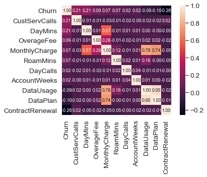
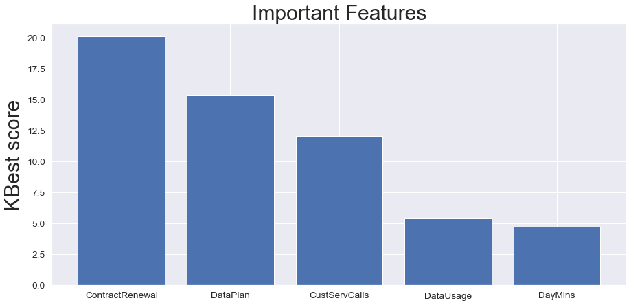

```python
import pandas as pd
import numpy as np
import matplotlib.pyplot as plt
import seaborn as sns
from sklearn import model_selection
from sklearn.preprocessing import OneHotEncoder
from pandas_profiling import ProfileReport
from sklearn.ensemble import RandomForestClassifier
from sklearn.metrics import plot_roc_curve
from sklearn.svm import SVC
from sklearn.model_selection import train_test_split
from sklearn.model_selection import cross_val_predict
from sklearn.feature_selection import SelectKBest
from sklearn.feature_selection import chi2
from sklearn.preprocessing import MinMaxScaler
from sklearn import preprocessing
import category_encoders as ce
from sklearn.utils import resample
import warnings
warnings.filterwarnings('ignore')
```


```python
df = pd.read_csv('telecom_churn.csv')
df.head()
```


<div>
<style scoped>
    .dataframe tbody tr th:only-of-type {
        vertical-align: middle;
    }

    .dataframe tbody tr th {
        vertical-align: top;
    }

    .dataframe thead th {
        text-align: right;
    }
</style>
<table border="1" class="dataframe">
  <thead>
    <tr style="text-align: right;">
      <th></th>
      <th>Churn</th>
      <th>AccountWeeks</th>
      <th>ContractRenewal</th>
      <th>DataPlan</th>
      <th>DataUsage</th>
      <th>CustServCalls</th>
      <th>DayMins</th>
      <th>DayCalls</th>
      <th>MonthlyCharge</th>
      <th>OverageFee</th>
      <th>RoamMins</th>
    </tr>
  </thead>
  <tbody>
    <tr>
      <th>0</th>
      <td>0</td>
      <td>128</td>
      <td>1</td>
      <td>1</td>
      <td>2.7</td>
      <td>1</td>
      <td>265.1</td>
      <td>110</td>
      <td>89.0</td>
      <td>9.87</td>
      <td>10.0</td>
    </tr>
    <tr>
      <th>1</th>
      <td>0</td>
      <td>107</td>
      <td>1</td>
      <td>1</td>
      <td>3.7</td>
      <td>1</td>
      <td>161.6</td>
      <td>123</td>
      <td>82.0</td>
      <td>9.78</td>
      <td>13.7</td>
    </tr>
    <tr>
      <th>2</th>
      <td>0</td>
      <td>137</td>
      <td>1</td>
      <td>0</td>
      <td>0.0</td>
      <td>0</td>
      <td>243.4</td>
      <td>114</td>
      <td>52.0</td>
      <td>6.06</td>
      <td>12.2</td>
    </tr>
    <tr>
      <th>3</th>
      <td>0</td>
      <td>84</td>
      <td>0</td>
      <td>0</td>
      <td>0.0</td>
      <td>2</td>
      <td>299.4</td>
      <td>71</td>
      <td>57.0</td>
      <td>3.10</td>
      <td>6.6</td>
    </tr>
    <tr>
      <th>4</th>
      <td>0</td>
      <td>75</td>
      <td>0</td>
      <td>0</td>
      <td>0.0</td>
      <td>3</td>
      <td>166.7</td>
      <td>113</td>
      <td>41.0</td>
      <td>7.42</td>
      <td>10.1</td>
    </tr>
  </tbody>
</table>
</div>


```python
df.describe()
```


<div>
<style scoped>
    .dataframe tbody tr th:only-of-type {
        vertical-align: middle;
    }

    .dataframe tbody tr th {
        vertical-align: top;
    }

    .dataframe thead th {
        text-align: right;
    }
</style>
<table border="1" class="dataframe">
  <thead>
    <tr style="text-align: right;">
      <th></th>
      <th>Churn</th>
      <th>AccountWeeks</th>
      <th>ContractRenewal</th>
      <th>DataPlan</th>
      <th>DataUsage</th>
      <th>CustServCalls</th>
      <th>DayMins</th>
      <th>DayCalls</th>
      <th>MonthlyCharge</th>
      <th>OverageFee</th>
      <th>RoamMins</th>
    </tr>
  </thead>
  <tbody>
    <tr>
      <th>count</th>
      <td>3333.000000</td>
      <td>3333.000000</td>
      <td>3333.000000</td>
      <td>3333.000000</td>
      <td>3333.000000</td>
      <td>3333.000000</td>
      <td>3333.000000</td>
      <td>3333.000000</td>
      <td>3333.000000</td>
      <td>3333.000000</td>
      <td>3333.000000</td>
    </tr>
    <tr>
      <th>mean</th>
      <td>0.144914</td>
      <td>101.064806</td>
      <td>0.903090</td>
      <td>0.276628</td>
      <td>0.816475</td>
      <td>1.562856</td>
      <td>179.775098</td>
      <td>100.435644</td>
      <td>56.305161</td>
      <td>10.051488</td>
      <td>10.237294</td>
    </tr>
    <tr>
      <th>std</th>
      <td>0.352067</td>
      <td>39.822106</td>
      <td>0.295879</td>
      <td>0.447398</td>
      <td>1.272668</td>
      <td>1.315491</td>
      <td>54.467389</td>
      <td>20.069084</td>
      <td>16.426032</td>
      <td>2.535712</td>
      <td>2.791840</td>
    </tr>
    <tr>
      <th>min</th>
      <td>0.000000</td>
      <td>1.000000</td>
      <td>0.000000</td>
      <td>0.000000</td>
      <td>0.000000</td>
      <td>0.000000</td>
      <td>0.000000</td>
      <td>0.000000</td>
      <td>14.000000</td>
      <td>0.000000</td>
      <td>0.000000</td>
    </tr>
    <tr>
      <th>25%</th>
      <td>0.000000</td>
      <td>74.000000</td>
      <td>1.000000</td>
      <td>0.000000</td>
      <td>0.000000</td>
      <td>1.000000</td>
      <td>143.700000</td>
      <td>87.000000</td>
      <td>45.000000</td>
      <td>8.330000</td>
      <td>8.500000</td>
    </tr>
    <tr>
      <th>50%</th>
      <td>0.000000</td>
      <td>101.000000</td>
      <td>1.000000</td>
      <td>0.000000</td>
      <td>0.000000</td>
      <td>1.000000</td>
      <td>179.400000</td>
      <td>101.000000</td>
      <td>53.500000</td>
      <td>10.070000</td>
      <td>10.300000</td>
    </tr>
    <tr>
      <th>75%</th>
      <td>0.000000</td>
      <td>127.000000</td>
      <td>1.000000</td>
      <td>1.000000</td>
      <td>1.780000</td>
      <td>2.000000</td>
      <td>216.400000</td>
      <td>114.000000</td>
      <td>66.200000</td>
      <td>11.770000</td>
      <td>12.100000</td>
    </tr>
    <tr>
      <th>max</th>
      <td>1.000000</td>
      <td>243.000000</td>
      <td>1.000000</td>
      <td>1.000000</td>
      <td>5.400000</td>
      <td>9.000000</td>
      <td>350.800000</td>
      <td>165.000000</td>
      <td>111.300000</td>
      <td>18.190000</td>
      <td>20.000000</td>
    </tr>
  </tbody>
</table>
</div>


```python
df.isnull().values.any()
```


    False


```python
df['Churn'].value_counts()
```


    0    2850
    1     483
    Name: Churn, dtype: int64


```python
#check outliers
from scipy import stats
out_df = df[(np.abs(stats.zscore(df)) < 3).all(axis=1)]
out_df['Churn'].value_counts()
```


    0    2598
    1     321
    Name: Churn, dtype: int64


```python
#saleprice correlation matrix
corrmat = df.corr()
k = 11 #number of variables for heatmap
cols = corrmat.nlargest(k, 'Churn')['Churn'].index
cm = np.corrcoef(df[cols].values.T)
sns.set(font_scale=1.25)
hm = sns.heatmap(cm, cbar=True, annot=True, square=True, fmt='.2f',
                 annot_kws={'size': 9}, yticklabels=cols.values, xticklabels=cols.values)
plt.savefig('heatmap.png')
```


    

    


```python
# split target and non-target
X = df.drop(columns='Churn')
y = df['Churn']
```


```python
# test train split 
X_train, X_test, y_train, y_test = train_test_split(X, y, test_size = 0.2,stratify = y,random_state = 22)
```


```python
from imblearn.over_sampling import SMOTE
def upsample_SMOTE(X_train, y_train, ratio=1.0):
    """Upsamples minority class using SMOTE.
    Ratio argument is the percentage of the upsampled minority class in relation
    to the majority class. Default is 1.0
    """
    sm = SMOTE(random_state=23, sampling_strategy=ratio)
    X_train, y_train = sm.fit_resample(X_train, y_train)
    print(len(X_train), len(y_train))
```


```python
upsample_SMOTE(X_train, y_train, ratio=1.0)
```

    4560 4560


```python
scaler = MinMaxScaler().fit(X_train)
X_train = scaler.transform(X_train)
X_test = scaler.transform(X_test)
```


```python
from sklearn.linear_model import LogisticRegression
from sklearn.svm import SVC, LinearSVC
from sklearn.neighbors import KNeighborsClassifier
from sklearn.tree import DecisionTreeClassifier
from sklearn.ensemble import RandomForestClassifier
from sklearn.naive_bayes import GaussianNB
from sklearn.neural_network import MLPClassifier

from sklearn.model_selection import cross_val_score

models = []

models.append(("LogisticRegression",LogisticRegression()))
models.append(("SVC",SVC()))
models.append(("LinearSVC",LinearSVC()))
models.append(("KNeighbors",KNeighborsClassifier()))
models.append(("DecisionTree",DecisionTreeClassifier()))
models.append(("RandomForest",RandomForestClassifier()))

results = []
names = []
for name,model in models:
    result = cross_val_score(model, X_train, y_train,  cv=3, scoring='roc_auc')
    names.append(name)
    results.append(result)

for i in range(len(names)):
    print(names[i],results[i].mean())
```

    LogisticRegression 0.8086356387273902
    SVC 0.8734070596185229
    LinearSVC 0.8106690349602204
    KNeighbors 0.8235343062567999
    DecisionTree 0.7645603835169319
    RandomForest 0.8798618814174487


```python
from sklearn import model_selection
from sklearn.metrics import confusion_matrix
from sklearn.metrics import classification_report

# random forest model creation
rfc = RandomForestClassifier()
rfc.fit(X_train,y_train)
# predictions
rfc_predict = rfc.predict(X_test)
rfc_cv_score = cross_val_score(rfc, X, y, cv=10, scoring='roc_auc')


print('Confusion Matrix')
print(confusion_matrix(y_test, rfc_predict))
print('\n')
print('--- Classification Report ---')
print(classification_report(y_test, rfc_predict))
print('\n')
print('--- All AUC Scores ---')
print(rfc_cv_score)
print('\n')
print('--- Mean AUC Score ---')
print('Mean AUC Score - Random Forest: ', rfc_cv_score.mean())
```

    Confusion Matrix
    [[559  11]
     [ 24  73]]
    
    
    --- Classification Report ---
                  precision    recall  f1-score   support
    
               0       0.96      0.98      0.97       570
               1       0.87      0.75      0.81        97
    
        accuracy                           0.95       667
       macro avg       0.91      0.87      0.89       667
    weighted avg       0.95      0.95      0.95       667
    
    
    
    --- All AUC Scores ---
    [0.90028643 0.9160401  0.88514142 0.85350877 0.93004386 0.91063596
     0.9371345  0.87335526 0.87024854 0.96542398]
    
    
    --- Mean AUC Score ---
    Mean AUC Score - Random Forest:  0.9041818832796278


```python
# Fit kbest to training data to view features by importance
KBest = SelectKBest(score_func = chi2, k=5)
KBest = KBest.fit(X_train,y_train)
```


```python
indice = np.argsort(KBest.scores_)[::-1]

# get top 5 feature names
features = []
for i in range(5):
    features.append(X.columns[indice[i]])

    
#plot by Kbest scores
plt.figure(figsize=(15, 7))
plt.bar(features, KBest.scores_[indice[range(5)]])
plt.title('Important Features', fontsize=30)
plt.ylabel('KBest score', fontsize=30)
plt.show()

```


    

    


```python
X_train_chi = KBest.transform(X_train)
X_test_chi = KBest.transform(X_test)
```


```python
# random forest model on chi2 data
rfc = RandomForestClassifier()
rfc.fit(X_train_chi,y_train)
# predictions
rfc_predict = rfc.predict(X_test_chi)
rfc_cv_score = cross_val_score(rfc, X, y, cv=10, scoring='roc_auc')


print('Confusion Matrix')
print(confusion_matrix(y_test, rfc_predict))
print('\n')
print('--- Classification Report ---')
print(classification_report(y_test, rfc_predict))
print('\n')
print('--- All AUC Scores ---')
print(rfc_cv_score)
print('\n')
print('--- Mean AUC Score ---')
print('Mean AUC Score - Random Forest: ', rfc_cv_score.mean())
```

    Confusion Matrix
    [[531  39]
     [ 36  61]]
    
    
    --- Classification Report ---
                  precision    recall  f1-score   support
    
               0       0.94      0.93      0.93       570
               1       0.61      0.63      0.62        97
    
        accuracy                           0.89       667
       macro avg       0.77      0.78      0.78       667
    weighted avg       0.89      0.89      0.89       667
    
    
    
    --- All AUC Scores ---
    [0.88893663 0.91757966 0.88342284 0.85394737 0.94780702 0.91107456
     0.93209064 0.87130848 0.88428363 0.96176901]
    
    
    --- Mean AUC Score ---
    Mean AUC Score - Random Forest:  0.9052219835302543


```python
from sklearn.model_selection import RandomizedSearchCV
# Number of trees in random forest
n_estimators = [int(x) for x in np.linspace(start = 100, stop = 2000, num = 10)]
# Number of features to consider at every split
max_features = ['auto', 'sqrt']
# Maximum number of levels in tree
max_depth = [int(x) for x in np.linspace(10, 110, num = 10)]
max_depth.append(None)
# Minimum number of samples required to split a node
min_samples_split = [2, 5, 10]
# Minimum number of samples required at each leaf node
min_samples_leaf = [1, 2, 4, 6]
# Method of selecting samples for training each tree
bootstrap = [True, False]
# Create the random grid
random_grid = {'n_estimators': n_estimators,
               'max_features': max_features,
               'max_depth': max_depth,
               'min_samples_split': min_samples_split,
               'min_samples_leaf': min_samples_leaf,
               'bootstrap': bootstrap}

```


```python
# Random search of parameters
rfc_random = RandomizedSearchCV(estimator = rfc, param_distributions = random_grid, n_iter = 100, cv = 3,
                                verbose=1, random_state=42, n_jobs = -1, scoring='recall')
# Fit the model
rfc_random.fit(X_train, y_train)
# print results
print(rfc_random.best_params_)
```

    Fitting 3 folds for each of 100 candidates, totalling 300 fits


    [Parallel(n_jobs=-1)]: Using backend LokyBackend with 8 concurrent workers.
    [Parallel(n_jobs=-1)]: Done  34 tasks      | elapsed:   59.6s
    [Parallel(n_jobs=-1)]: Done 184 tasks      | elapsed: 59.4min
    [Parallel(n_jobs=-1)]: Done 300 out of 300 | elapsed: 61.3min finished


    {'n_estimators': 522, 'min_samples_split': 2, 'min_samples_leaf': 2, 'max_features': 'sqrt', 'max_depth': 110, 'bootstrap': True}


```python
# fine tune model
rfc = RandomForestClassifier(n_estimators=522, min_samples_split=2, min_samples_leaf=2, 
                             max_features='sqrt', max_depth=110, bootstrap=True)
rfc.fit(X_train, y_train)
# predictions
rfc_predict = rfc.predict(X_test)
rfc_cv_score = cross_val_score(rfc, X, y, cv=10, scoring='roc_auc')


print('Confusion Matrix')
print(confusion_matrix(y_test, rfc_predict))
print('\n')
print('--- Classification Report ---')
print(classification_report(y_test, rfc_predict))
print('\n')
print('--- All AUC Scores ---')
print(rfc_cv_score)
print('\n')
print('--- Mean AUC Score ---')
print('Mean AUC Score - Random Forest: ', rfc_cv_score.mean())
```

    Confusion Matrix
    [[564   6]
     [ 26  71]]
    
    
    --- Classification Report ---
                  precision    recall  f1-score   support
    
               0       0.96      0.99      0.97       570
               1       0.92      0.73      0.82        97
    
        accuracy                           0.95       667
       macro avg       0.94      0.86      0.89       667
    weighted avg       0.95      0.95      0.95       667
    
    
    
    --- All AUC Scores ---
    [0.88779091 0.92860723 0.86913713 0.83464912 0.94312865 0.90628655
     0.92624269 0.8755848  0.88369883 0.96023392]
    
    
    --- Mean AUC Score ---
    Mean AUC Score - Random Forest:  0.9015359828141782


```python
from sklearn.metrics import plot_confusion_matrix

plot_confusion_matrix(rfc, X_test, y_test,
                                 cmap=plt.cm.Blues)
```


    <sklearn.metrics._plot.confusion_matrix.ConfusionMatrixDisplay at 0x129f51970>


    

    

